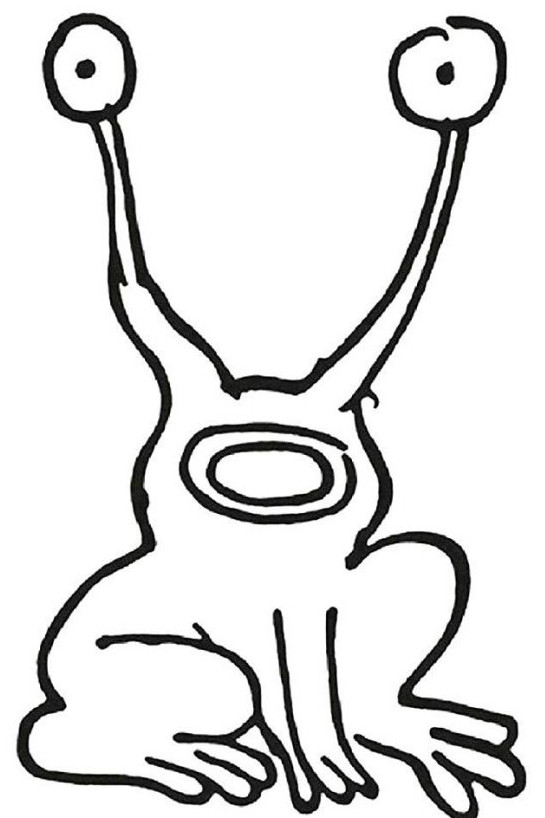

# frogsay

Like cowsay but with a frog.

```text
  (o) (o)
    \_/
   ( ~ )
   /   \
  /  Y  \
 ( ) | ( )
  " " " "
```

Frog inspired by:



Forked from [cowsay](https://github.com/cowsay-org/cowsay.git).

## Install

```sh
make install
```

Installs to `/usr/local` by default. For another destination, invoke:

```sh
make install prefix=</path/to/dir>
```

## Usage

```sh
frogsay -e <eyes> -m <mouth> "message"
```

The `-e` are 1 or 2 characters for the eyes, and `-m` is 1 character for the
mouth. Pass `-f <frog>` to use a non-default frog, `-c <1 char>` to display a
necklace ornament, or use a preset expression (e.g. `-p happy`).

Use `frogsay -h` or `man frogsay` for more thorough usage information.
